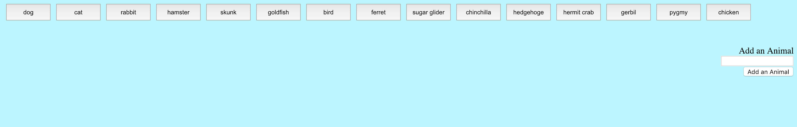
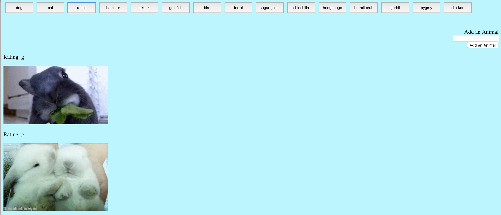

# GifTastic
Generating Giphy images using Giphy API when clicking button.

*Used Jquery liberary for AJAX call and displayed GIF object URL. 

*Also we can add Button using From input which can be used for AJAX call and generate GIPHY images

##### Initially Loading of the Page

##### Giphy Image generated based on Button click

